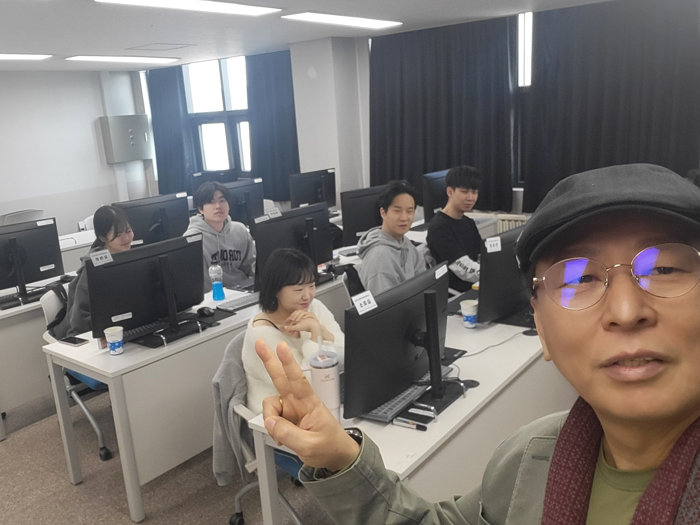

# 2025Robot
2025 ROBOT응용 SW 개발자 과정 
1. 김희웅 https://github.com/heewoong21
2. 안성진 https://github.com/radiant998
3. 김미소 https://github.com/kim-smile
4. 이진수  https://github.com/jjkkhh123
5. 김하은 https://github.com/haeun0908
6. 김태민 https://github.com/gomtam 
7. 이용전 https://github.com/wads1234k
8. 김선준 https://github.com/pocky75
9. 이민용 https://github.com/dlalsdyd01
10. 조우석 https://github.com/ouseok00
11. 김지훈 https://github.com/rlawlgns02 https://rlawlgns02.github.io/testWeb/
12. 백민재 https://github.com/minjae010317 https://minjae010317.github.io/Readme.md/
13. 임강진 https://github.com/ggzz5272   https://ggzz5272.github.io/Readme.md/

지금 우리 공부 하고 있는 모습 

![이미지 2] (image/KakaoTalk_20250314_095734516_01.jpg)

웹페이지를 불러 오기 
https://kidd.co.kr/news/238803

1. 파이썬 개발 환경 구축후 첫 프로젝트 https://github.com/Emmett6401/myPrjt002
2.  
